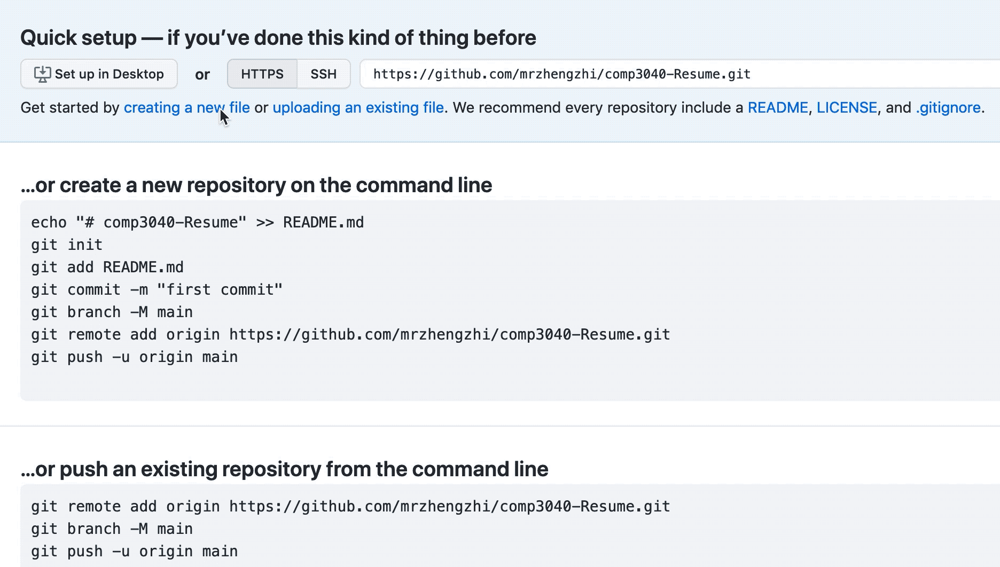
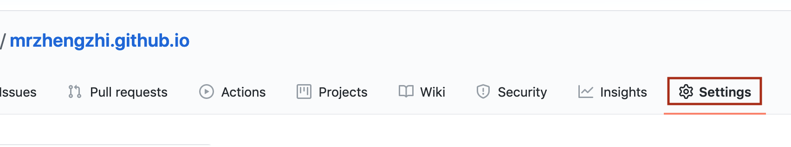
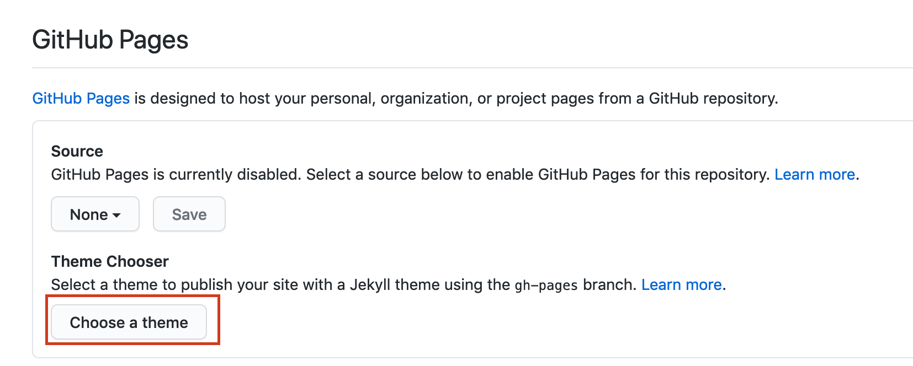

# How to host a resume on GitHub Pages
Welcome! We will learn how to host a resume on GitHub Pages!
- [How to host a resume on GitHub Pages](#how-to-host-a-resume-on-github-pages)
  - [Purpose](#purpose)
  - [Prerequisites](#prerequisites)
  - [Instructions](#instructions)
      - [Convert your resume to Markdown format](#convert-your-resume-to-markdown-format)
      - [Add your resume to GitHub](#add-your-resume-to-github)
      - [Customize the theme of your resume page](#customize-the-theme-of-your-resume-page)
  - [More Resources](#more-resources)
      - [GitHub Pages](#github-pages)
      - [Markdown](#markdown)
      - [Jekyll](#jekyll)
      - [Technical Writing](#technical-writing)
  - [Authors and Acknowledgments](#authors-and-acknowledgments)
  - [FAQs](#faqs)
     

## Purpose
This tutorial will guide you how to create a markdown formatted resume by markdown editor. After that, you will learn how to build a repository on GitHub and how to add your resume to the repository. Further, you will learn how to change the theme of your resume. 
Also, through this tutorial, you can understand the key concepts from Andrew Etter's book *"Modern Technical Writing: An Introduction to Software Documentation"* :

## Prerequisites
1. A Markdown editor.
   + There are several excellent editors to choose from. Please check [The 10 Best Markdown Editors of 2020](https://www.shopify.com/partners/blog/10-of-the-best-markdown-editors).
   + I use [visual studio code](https://code.visualstudio.com/) with [Markdown Preview Enhanced](https://marketplace.visualstudio.com/items?itemName=shd101wyy.markdown-preview-enhanced) to write this tutorial.
2. A GitHub account.
   + You can visit [Github](https://github.com/) to sign up an account.
3. An up-to-date resume.


## Instructions
I hope that through this practice, you can understand the following key concepts in Andrew Etter's book: 

 **1. Using a lightweight markup language."** It is easier to generate well-formed documentation using lightweight markup language. It is simple, easy to read and easy to learn, which can increase developer's enthusiasm to contribute to technical writing. In this tutorial, we will use the most widely used lightweight markup language **Markdown**. 

 **2. Using distributed version control systems.**  Distributed version control systems have high performance and can be used offline. We can put the code and the corresponding documentation in the same repository, which makes it easy to keep them in sync. In this tutorial, we will use distributed version control systems through GitHub.

 **3. Making static websites.** Static websites are efficient, simple and secure because they do not need databases, server side dependencies, or installation of anything else. We can use a static website generator with lightweight markup language and theme template to generate them. In this tutorial, we will learn how to generate a static website page in GitHub and use the Jekyll template.


#### Convert your resume to Markdown format

The following is a step-by-step tutorial on using markdown to make a resume.

1. Open the Markdown editor (e.g. Visual Studio Code ), then create a new file and save it as `resume.md`.
   
2. Put the name and contact information on the top of the resume.
   ```
    # Your name

    + Your address
    + Your phone number
    + Your email

   ```
   Note: # and a space indicate  the biggest header. You can use 1-6 # to indicate  all levels of headers, and 6 # is the smallest header.
   
3. Add second level subheadings, for example:
   
   ```
    ## Education

    ## Soft Skills

    ## Technical Skills

    ## Volunteer Experience

    ## Work experience

    ## Projects

   ```

4. Fill in the details under the second level subheadings, for example:

   ```
    ## Education
    + Bachelor of Science in Computer Science / **University of Manitoba**
     &nbsp; *September 2016-Present* 

    ## Soft Skills
    + Good communication skills

    ## Technical Skills
    ### Languages
     Java, JavaScript, C++, C, Python
    ### Tools
    Eclipse, Visual Studio Code, JUnit, Processing

    ## Work experience
    + Book Editor / **China Industry Press**
    &nbsp; *March 2010-November 2015* 

   ```

  #### Add your resume to GitHub
  1. Sign up and log in your GitHub account.

  2. Create a new repository on Github.
     * Click "strat a project" on your GitHub home page.
     * Enter "[Your Username].github.io" in the blank space of Repository name.
     * Choose "Public".
     * Click "Create repository". Then it will jump to a new page.
  3. Click on the "Creating a new file" link in "Quick setup" section.
  4. Name the file as `index.md`. 
   **Note**: *This name is very important! If the name is not `index.md`, your resume will not be displayed on GitHub page.*
  
  
  5. Open your existing Markdown formatted resume `resume.md` and copy its contents.
  6. Paste your resume into "Edit new file" area of `index.md` in Github.
  7. Click the "Commit new file" button at the bottom.
   Now, your resume is hosted on Github pages. If you want to see it, go to `https://[Your Username].github.io`. For example, my resume is hosted on `https://mrzhengzhi.github.io`.

   #### Customize the theme of your resume page
At present, our resume page is only the basic version. Fortunately, we can use the some Jekyll template that comes with GitHub pages to change the appearance and style of our resume pages.
  1. Click  "Settings" in your repository.
   
  2. Scroll to the "GitHub Pages" section and click "Choose a theme" button.
   
  3. Select one of those themes that you like and click "Select theme" button.
  4. Select "code" and you will find that there is a new file "_config.yml" in your repository. This file can be used to set the theme of your resume page. Now you can go to `https://[Your Username].github.io` to see your new theme.


   
## More Resources
#### GitHub Pages
+ [GitHub Pages](https://pages.github.com/)
+ [Working with GitHub Pages](https://docs.github.com/en/free-pro-team@latest/github/working-with-github-pages)
#### Markdown
+ [Markdown Quick Tutorial](https://helloacm.com/markdown-markup-language-quick-tutorial/)
+ [Markdown Guide](https://www.markdownguide.org/getting-started)
+ [Markdown Cheat Sheet](https://www.markdownguide.org/cheat-sheet)
#### Jekyll
+ [Jekyll Video Tutorial](https://www.youtube.com/playlist?list=PLLAZ4kZ9dFpOPV5C5Ay0pHaa0RJFhcmcB)
#### Technical Writing
+ [Modern Technical Writing: An Introduction to Software Documentation](https://www.amazon.ca/Modern-Technical-Writing-Introduction-Documentation-ebook/dp/B01A2QL9SS)

## Authors and Acknowledgments
This Tutorial was written by [Zhi Zheng](https://github.com/mrzhengzhi).


My group members:
 Jaskeerat Singh
 Ali Jasim
 Matthew De La Torre


## FAQs
**1. Why is Markdown better than a word processor?**
Markdown is a simple lightweight language, so it's very easy to learn. It has no complex syntax and functions, so it is very efficient to use. Markdown files can be easily converted into HTML and PDF files. In the field of technology, it is widely used to create documentations, such as on GitHub. Therefore, as students of CS, markdown is a better choice for us.

**2. How do I update my resume ?**
First, go to your resume repository. Second, click `index.md` file. Third, click the pencil icon on the right (i.e."Edit this file"). After that, you can edit your resume. You can view changes through the "Preview changes". After you finish editing, you need to click the green button "commit changes" at the bottom. Now you have finished updating your resume! Very easy, right?
